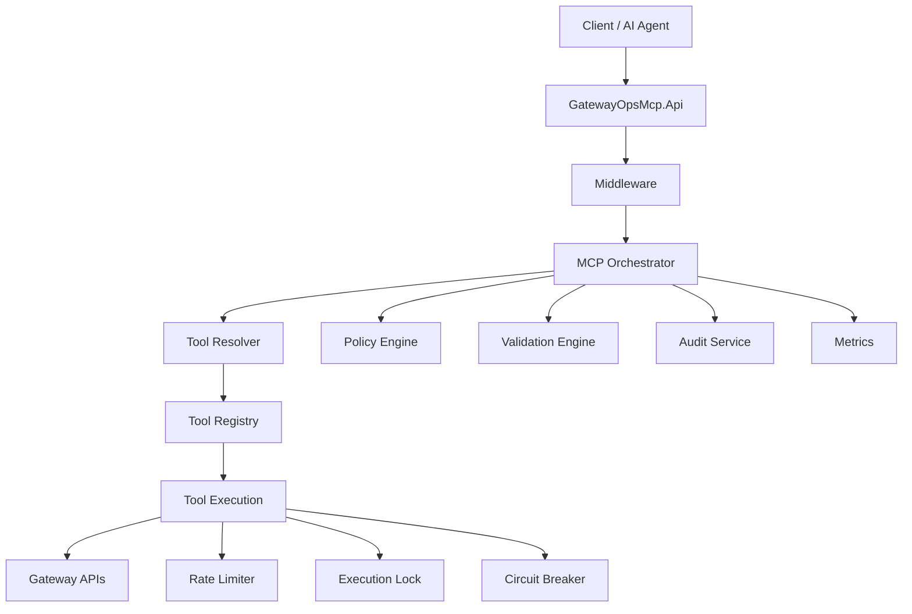

# System Diagram

---

## Responsibilities

### API
Transport layer and endpoint handling.

### Middleware
Authentication, authorization, context, tracing.

### Orchestrator
Coordinates execution.

### Tool Layer
Business capabilities.

### Infrastructure
Observability, resilience, security.
